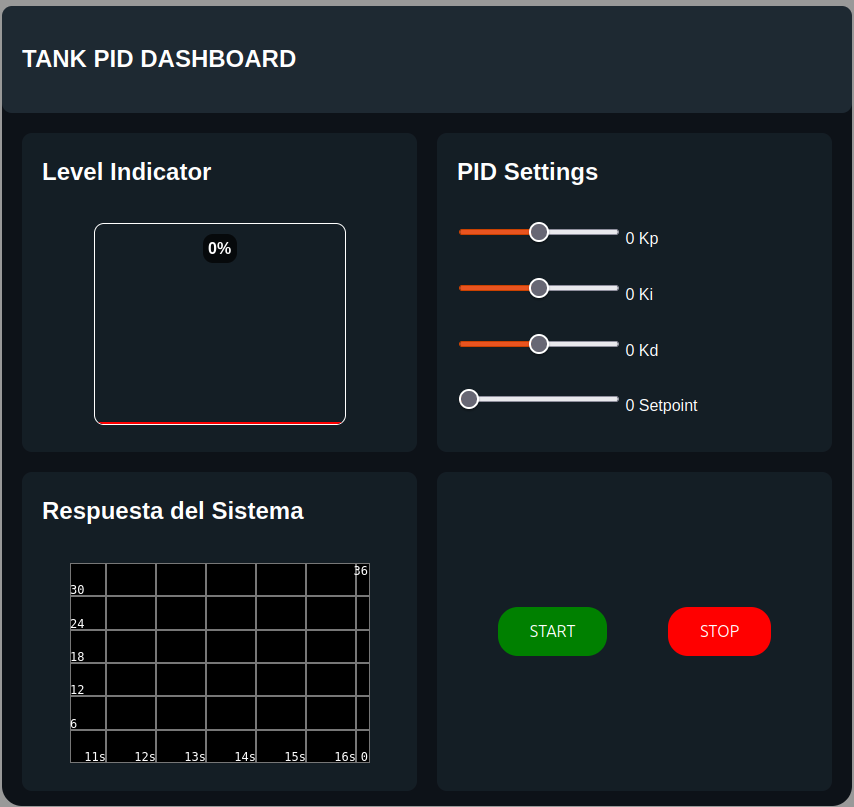

# _Tank Level PID Controller_

IoT-based tank water level control system using a PID controller running on an ESP32, with an embedded web interface (HTML/CSS/JS) served directly from the microcontroller for real-time monitoring and tuning.

## About the project 
This project implements a **PID-controlled tank level system** integrated with **IoT capabilities**. The ESP32 not only executes the PID algorithm and controls the actuator, but also **hosts a web server** that serves an HTML/CSS/JavaScript interface for real-time monitoring, setpoint changes, and PID parameter tuning — all accessible from any device on the local network.

**Context:**
- Developed as a thesis project for electronics engineer degree
- Real-world application: level control in water treatment, chemical, or food processing industries

**Goal:** Design, implement, and tune a PID controller that:
- Maintains the tank level at a defined setpoint
- Rejects disturbances (leaks, flow changes) in < X seconds
- Provides a live web dashboard served directly from the ESP32
- Logs data for post-run analysis

## 🌐 Demo

🌐 **Live Dashboard:** Accessible at `http://192.168.4.1/` on your local network

## ✨ Features

- ✅ Full PID control (adjustable Kp, Ki, Kd)
- ✅ **IoT web server embedded on ESP32** (no external server needed)
- ✅ **Real-time dashboard** with HTML/CSS/JS served from the ESP32
- ✅ Live data streaming via **WebSockets**
- ✅ Setpoint and PID tuning from the web interface
- ✅ Level measurement via ultrasonic sensor (HC-SR04)
- ✅ DC pump / solenoid valve actuation via PWM
- ✅ Data logging to CSV / SPIFFS / LittleFS
- ✅ Anti-windup on the integrator

## 🔧 Physical Components

| Component | Model | Function |
|-----------|-------|----------|
| Microcontroller | ESP32 DevKit v1 | Runs PID + hosts web server |
| Level sensor | HC-SR04 | Measures water level |
| Actuator | 12V DC pump + MOSFET driver | Injects water into tank |
| Tank | Glass 36×21×21 cm | Liquid container |
| Power supply | 12V 5A | System power |

## 💻 Software & Tools

- **Firmware:** C (ESP-IDF framework) with `esp_http_server`, `esp_websocket_server`, and `cJSON`
- **Web Frontend:** HTML5, CSS3, JavaScript (SmoothieChart.js for real-time plots)
- **Communication:** WebSocket (real-time bidirectional data streaming)
- **File System:** LittleFS (stores `index.html`, `style.css`, `app.js`, and CSV logs)
- **Data Analysis:** Python (numPy, matplotlib) for post-run analysis
- **Version Control:** Git & GitHub

### Key ESP-IDF Components

| Component | Purpose |
|-----------|---------|
| `esp_http_server` | Non-blocking HTTP server for serving HTML/CSS/JS from SPIFFS |
| `esp_websocket_server` | Real-time telemetry streaming to the browser |
| `esp_spiffs` | Mounting and serving the web assets + CSV logs from flash |
| `cJSON` | Serializing PID data as JSON for the frontend |
| `driver/ledc` | Hardware PWM for the pump/valve control |
| `driver/gpio` | HC-SR04 sensor triggering and echo reading |
| `FreeRTOS` | Precise sampling loop for the PID + Export data through WS |
| `nvs_flash` | Storing Wi-Fi credentials and PID parameters persistently |

> **Data flow:** The ESP32 runs the PID loop at 1.43 Hz using `vTaskDelayUntil`, stores web assets in LittleFS, serves them over HTTP via `esp_http_server`, and streams live telemetry to the browser through `esp_websocket_server`. The browser renders the dashboard with SmoothieChart.js and sends setpoint/gain updates back through the same WebSocket.